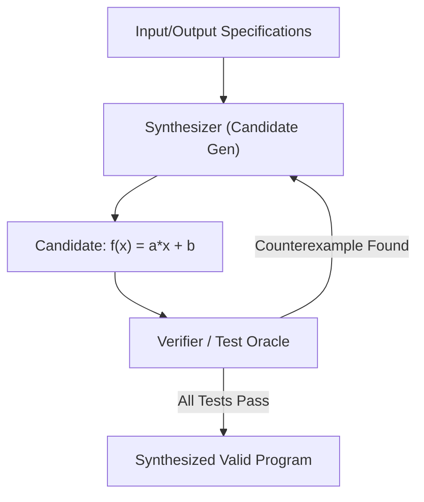

# CEGIS Program Synthesizer Skill

High-efficiency, zero-dependency Python implementation of **Counterexample-Guided Inductive Synthesis (CEGIS)** for deductive program generation.

## Features
- **Specification Satisfiability**: Iteratively selects candidate programs and validates against accumulated counterexamples.
- **Deductive Synthesis Search**: Systematically prunes inconsistent program hypothesis classes.
- **Zero External Dependencies**: Pure Python standard library.
- **Native MCP Protocol**: JSON-RPC 2.0 stdio server compatible with Claude Desktop, Cursor, and Windsurf.

## Architecture

